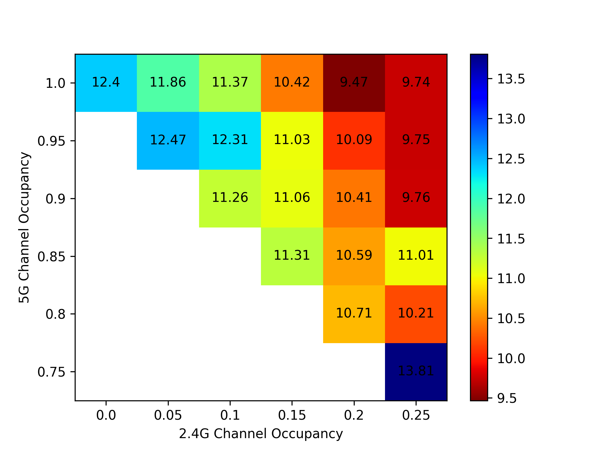
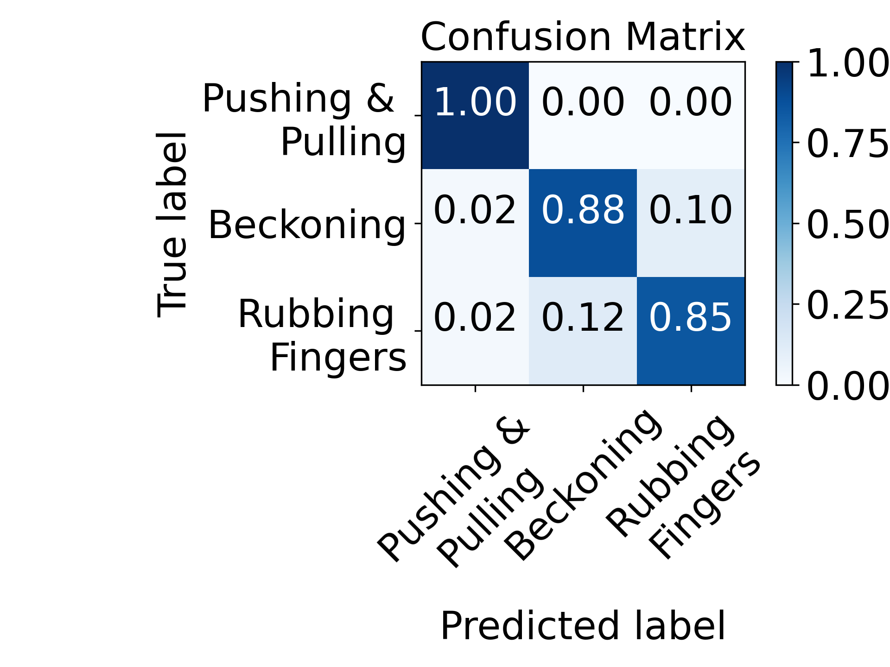
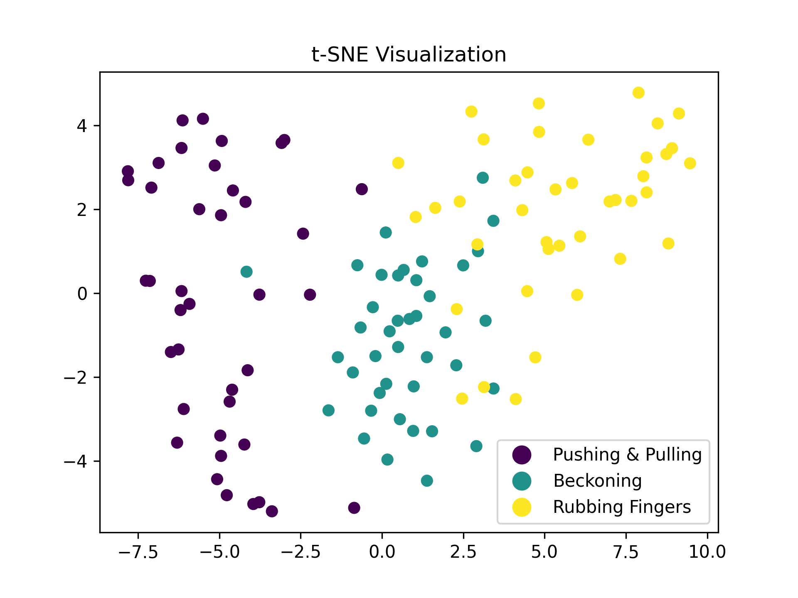

# sciplotlib

Collections of plot functions for scientific purpose. 

## Gallery

<table align="center">
  <tr>
    <th><a href="./src/heatmap.py">heatmap.py</a></th>
    <th><a href="./src/confusionchart.py">confusionchart.py</a></th>
    <th>barchart.py</th>
  </tr>
  <tr align="center">
    <td></td>
    <td></td>
    <td>To be updated ...</td>
  </tr>
  <tr>
    <th align="center"><a href="./src/tsne.py" alt="tsne">tsne.py</a></th>
    <th align="center">line.py</th>
    <th align="center">pie.py</th>
  </tr>
  <tr align="center">
    <td></td>
    <td>To be updated ...</td>
    <td>To be updated ...</td>
  </tr>
  <tr>
    <th align="center">box.py</th>
    <th align="center">cdf.py</th>
    <th align="center">pdf.py</th>
  </tr>
  <tr align="center">
    <td>To be updated ...</td>
    <td>To be updated ...</td>
    <td>To be updated ...</td>
  </tr>
</table>

## Dependencies

```
pip3 install -r requirements.txt
```

## Useful Resources

Python:

+ [SciencePlots](https://github.com/garrettj403/SciencePlots) and [LovelyPlots](https://github.com/killiansheriff/LovelyPlots): scientific plot style for line plot in matplotlib.
+ [python_plot_utils](https://github.com/guanyingc/python_plot_utils): a simple code for plotting figure, colorbar, and cropping with python.

MATLAB:

+ [paper_quality_plot.matlab](https://github.com/LimHyungTae/paper_quality_plot.matlab): paper quality plots of CDF, PDF, line graph, box plots, ...